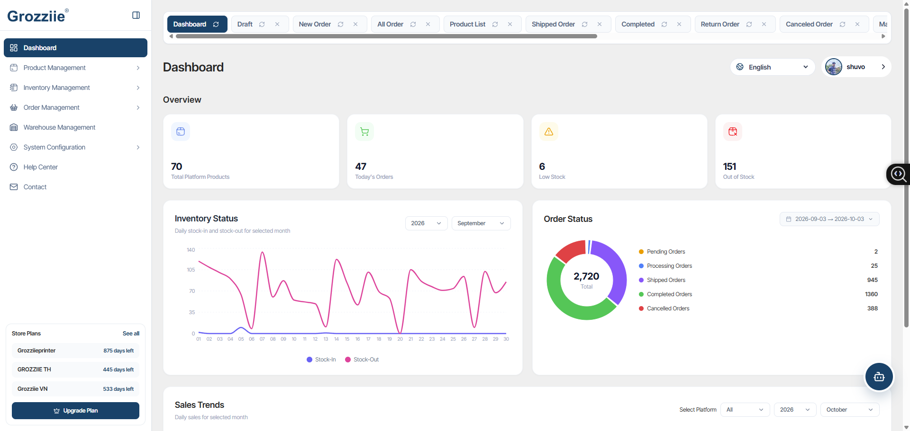
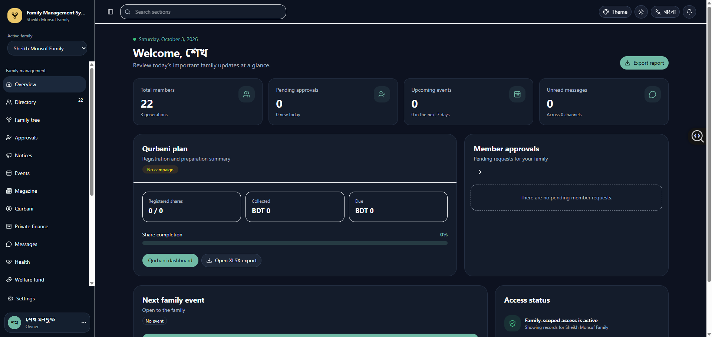
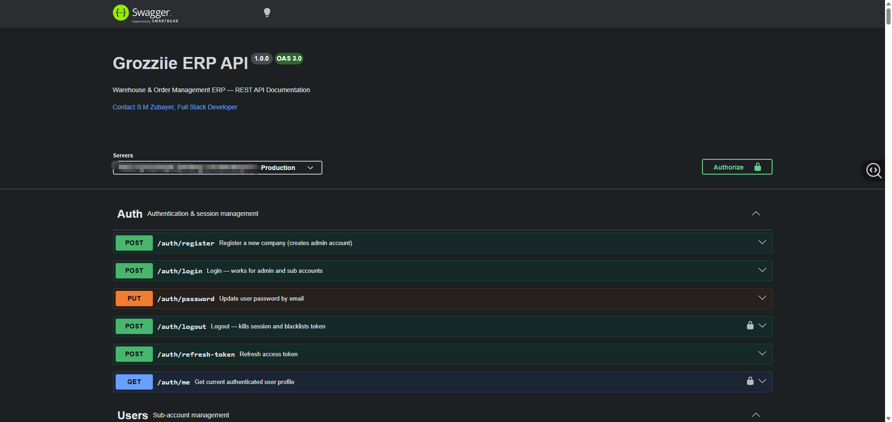
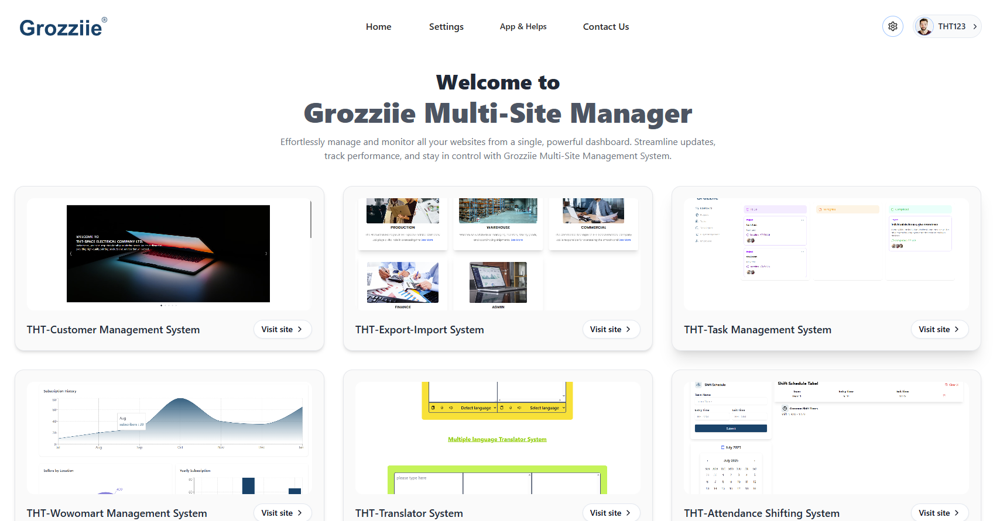
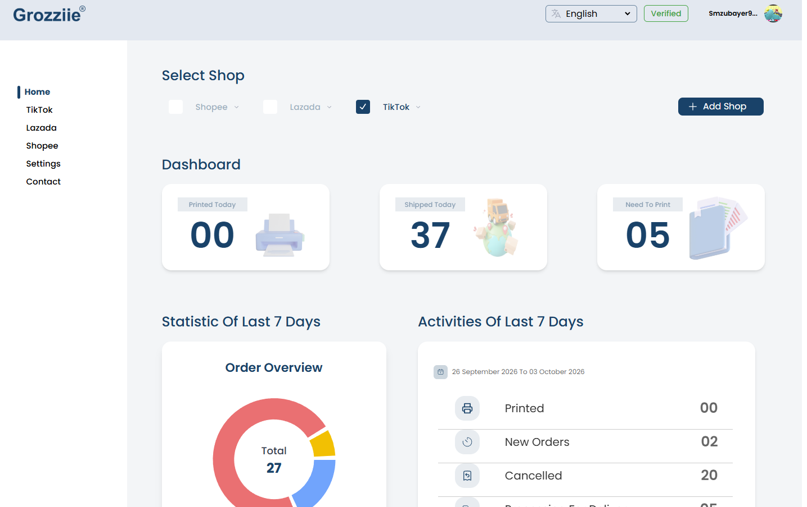
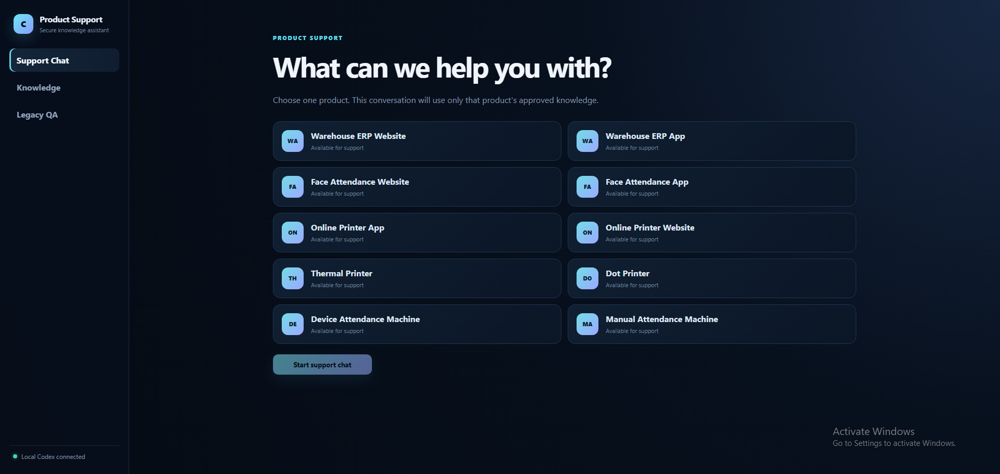
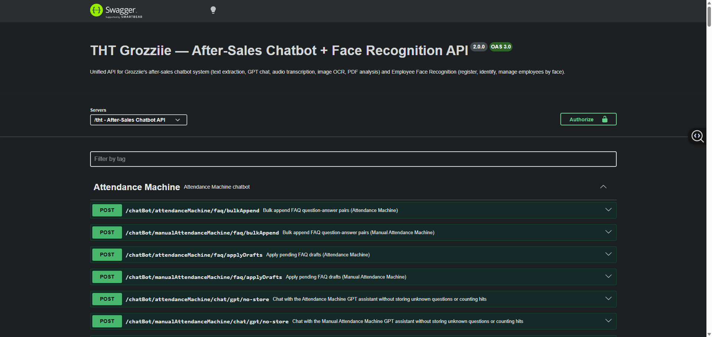

# Hey, I'm Zubayer 👋

I build full-stack apps for real-world workflows: warehouse operations, marketplace orders, family coordination, and AI-assisted support. I enjoy both sides of the work—a clear interface up front and solid APIs and data behind it.

**Current focus:** warehouse and company ERP · family platforms · online printing · product support AI

## What I like building

- 🏭 **ERP and marketplace tools:** inventory across warehouses, SKU mapping, orders, permissions, and seller-store workflows. Warehouse ERP includes Shopee/TikTok Shop-style order flows; THT ERP adds task, customer, attendance, export/import, and commerce modules.
- 👨‍👩‍👧 **Family and community platforms:** bilingual spaces for family records, a family tree, events, Qurbani planning, finance, and chat. The Family Management System is an active, evolving project.
- 🤖 **AI and support APIs:** translation, language detection, product support chat, document and media processing, FAQs, and face attendance services.
- 🖨️ **Printer apps and company tools:** In my current role, I enjoy building printer-related apps and company software—from warehouse ERP to smaller management tools that keep daily operations organized.
- 🛒 **Commerce and printing experiences:** web interfaces that make online printing and business workflows easier to navigate.

## Selected projects

### 1. [Warehouse Management ERP — frontend](https://github.com/S-M-ZUBAYER/Warehouse-Management-ERP-System)

A React 19 interface for product and SKU management, multi-warehouse inventory, orders, permissions, and analytics. Built with Vite 7, TanStack Query, Zustand, and Tailwind CSS.

### 2. [Family Management System](https://github.com/S-M-ZUBAYER/family-management-system)

A bilingual family workspace for members and approvals, a family tree, events, chat, Qurbani planning, finance, and administration. Built with React 19, TypeScript, Vinext, and Supabase PostgreSQL; in active development.

### 3. [Warehouse Management ERP — backend](https://github.com/S-M-ZUBAYER/Warehouse-Management-ERP-Server-Site)

A multi-tenant Node.js and Express API for inventory, stock flows, orders, permissions, and marketplace SKU mapping. It uses MySQL, Sequelize, Redis, JWT, and Swagger/OpenAPI documentation.

### 4. [THT ERP Management System](https://github.com/S-M-ZUBAYER/THT-ERP-Management-System)

A modular JavaScript, React, and Vite frontend that connects task, customer, attendance, import/export, translation, and commerce tools for company operations.

### 5. [Grozziie Online Printer](https://github.com/S-M-ZUBAYER/Grozziie-Online-Printer)

A React and Vite app for marketplace printing. It brings Shopee, Lazada, and TikTok Shop order screens together with batch and AWB printing, shipping, and store workflows.

### 6. [Translator, Detection and AI Chat Server](https://github.com/S-M-ZUBAYER/Translator-Detect-AI-Chat-Bot-Face-Detect-server-site)

Express and MySQL APIs for product-specific support chat, translation, language detection, document and media workflows, and face attendance. The support screen below shows how users choose a product's approved knowledge before starting a chat.

The same project also has documented endpoints for the after-sales chatbot and employee face recognition:

**More projects:** [BuddyScript frontend](https://github.com/S-M-ZUBAYER/Buddy-Script-Frontend-Site) · [BuddyScript backend](https://github.com/S-M-ZUBAYER/Buddy-Script-Server-Site) · [all repositories](https://github.com/S-M-ZUBAYER?tab=repositories)

## Tools I use

**Frontend:** **JavaScript** (primary), TypeScript, React, Vite, Tailwind CSS, TanStack Query, Zustand  
**Backend and APIs:** Node.js, Express, REST, JWT, Swagger/OpenAPI, OpenAI  
**Data:** MySQL, PostgreSQL/Supabase, Redis, Sequelize

You'll also find earlier work on task management, school management, and online shops. [Browse all my repositories](https://github.com/S-M-ZUBAYER?tab=repositories).

## Say hello

Find me on [LinkedIn](https://www.linkedin.com/in/s-m-zubayer/).
